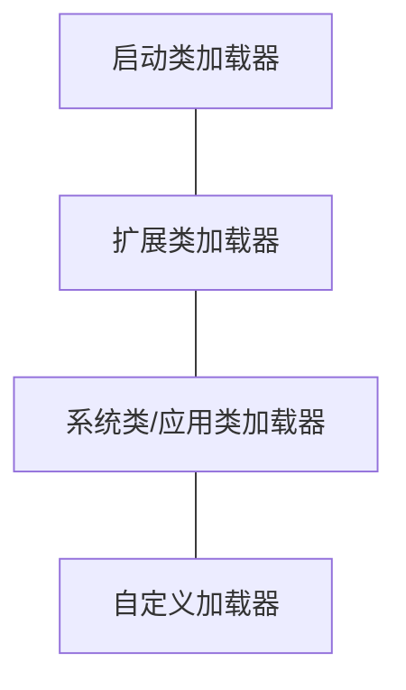
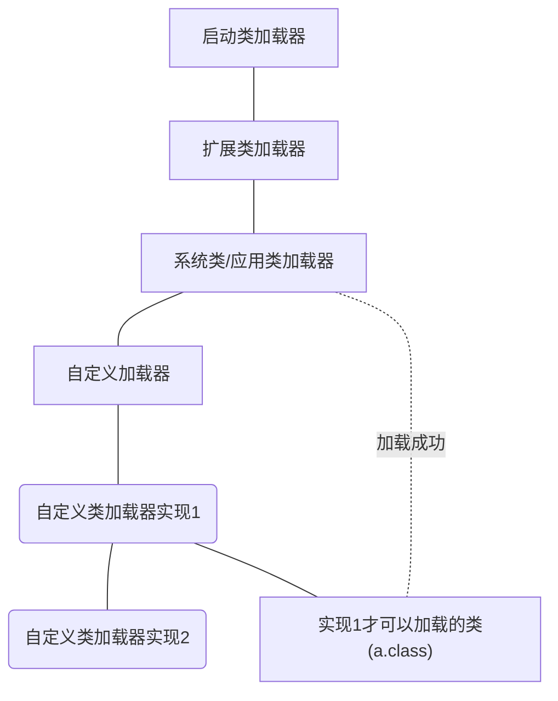

# 类加载器

> **Java Doc**
>
> 类加载器是一个负责加载对象类,类加载器是一个抽象类,通过一段**二进制名称**,类加载器尝试查找和生成该类的数据,典型的策略就是将名称转换成文件名,从本地文件系统中读取该名称的Class文件。
>
> 每个Class都包含了**定义它**的**类加载器**的引用,数组类的Class对象,**不是**由类加载器创建的,而是JVM运行时的时候**自动创建**的,一般会和它包含的对象中的Class.getClassLoader()相同,如果数组包含的基础对象,那么这个数组的类加载器为**null**(没有类加载器)
>
> ```java
> String[] str = new String[2];
> System.out.println(str.getClass());//[java.lang.String.class
> System.out.println(str.getClass().getClassLoader());//null,String的类加载器是null,根类加载器
> System.out.println("=================================");
> MyTest15[] myTest15s = new MyTest15[2];
> System.out.println(myTest15s.getClass().getClassLoader());//AppClassLoader
> System.out.println("=================================");
> int[] ints = new int[2];
> System.out.println(ints.getClass().getClassLoader());//null,数组类型没有类加载器,基础类型的数组没有类加载器,并不是根类加载器
> ```
>
> 可以通过继承类加载器来扩展JAVA的类加载器,编码人员可以通过使用类加载器来显示的指定安全域。类加载器除了加载类以外,还负责查找资源(一些数据,.class文件,配置数据等),这些文件用/分割路径,通常和我们的应用程序或者库打包在一起,以便可以通过代码在应用程序库中找到他们.资源通常会和我们的应用程序或者库打包在一起,以便可以通过代码在应用程序或者库中找到,在某些情况下,会包括资源,方便其他库可以找到它们.
>
> 类加载器使用**双亲委派模型**搜索类和资源,每个类加载器实例都关联了一个**父类加载器**.当请求查找类或者资源的时候,类加载器通常会在**尝试加载资源或Class之前**将资源交给父类加载器加载,支持并发加载类的类加载器称作并行类加载器,要求它们通过ClassLoader.registerAsParallelCapable方法在这个类初始化的时候注册。！注意，默认情况下，类加载器注册成为并行类加载器，但是如果它们的子类也具有并行功能，那么仍然需要注册，双亲委派模并没有严格分层，类加载器需要有并行功能，否则类加载器会保持死锁，因为类加载器加载的过程中保持了加载器锁（loadClass方法）。
>
> 运行时内置类加载器：Bootstrap类加载器
>
> **它是虚拟机的内置类加载器，通常表示为null，并且没有父级**但可以用作ClassLoader实例的父级。支持并发加载类的类加载器称为具有并行功能的类加载器，并且要求它们通过调用ClassLoader.registerAsParallelCapable方法在其类初始化时进行自身注册。请注意，默认情况下，ClassLoader类注册为具有并行功能。但是，如果它们的子类具有并行功能，则仍然需要注册自己。在委派模型不是严格分层的环境中，**类加载器需要具有并行功能**，否**则类加载会导致死锁**，因为在类加载过程中保持了**加载器锁**（请参见loadClass方法）。通常，Java虚拟机以平台相关的方式从本地文件系统加载类。例如，在UNIX系统上，虚拟机从CLASSPATH环境变量定义的目录中加载类。但是，某些类可能不是源自文件的。它们可能源自其他来源，例如网络，也可能由应用程序构造。由**defineClass**方法将字节数组转换为Class类的实例。可以使用Class.newInstance创建此新定义的类的实例。由类加载器创建的对象的方法和构造函数可以引用其他类。为了确定所引用的类，Java虚拟机将调用最初创建该类的类加载器的loadClass方法。例如，应用程序可以创建网络类加载器以从服务器下载类文件。
>
> ```java
> ClassLoader loader = new NetworkClassLoader(host，port);
> Object main = loader.loadClass("Main"，true).newInstance();
> /////
> 
>      class NetworkClassLoader extends ClassLoader {
>           String host;
>           int port;
>  
>           public Class findClass(String name) {
>               byte[] b = loadClassData(name);
>               return defineClass(name, b, 0, b.length);
>           }
>  
>           private byte[] loadClassData(String name) {
>               // load the class data from the connection
>           }
>       }
> ```
>
> 
>
> 平台类包括Java SE平台API，它们的实现类以及由平台类加载器或其祖先定义的特定于JDK的运行时类。为了允许升级/覆盖定义到平台类加载器的模块，以及允许升级的模块读取定义到平台加载器及其祖先以外的类加载器的模块，则平台类加载器可能必须委托给其他类加载器，例如，应用程序类加载器。换句话说，为平台类加载器定义的命名模块中定义给平台加载器及其祖先以外的类加载器的类可能是可见的。系统类加载器。它也称为应用程序类加载器，与平台类加载器不同。系统类加载器通常用于在应用程序类路径，模块路径和特定于JDK的工具上定义类。平台类加载器是所有平台类可见的系统类加载器的父代或祖先。
>
> 通常，Java虚拟机以平台相关的方式从本地文件系统加载类。但是，某些类可能不是源自文件的。它们可能源自其他来源，例如网络，也可能由应用程序构造。方法defineClass将字节数组转换为Class类的实例。可以使用Class.newInstance创建此新定义的类的实例。由类加载器创建的对象的方法和构造函数可以引用其他类。为了确定所引用的类，Java虚拟机将调用最初创建该类的类加载器的loadClass方法。例如，应用程序可以创建网络类加载器以从服务器下载类文件。
>
> 例如，应用程序可以创建网络类加载器以从服务器下载类文件。示例代码可能如下所示：
>
> ```java
> ClassLoader loader = new NetworkClassLoader(host, port);
> Object main = loader.loadClass("Main", true).newInstance();
>     . . .
> ```
>
> 网络类加载器子类必须定义方法findClass和loadClassData才能从网络加载类。下载构成类的字节后，应使用defineClass方法创建类实例。一个示例实现是：
>
> ```java
> class NetworkClassLoader extends ClassLoader {
>      String host;
>        int port;
> 
>         public Class findClass(String name) {
>            byte[] b = loadClassData(name);
>             return defineClass(name, b, 0, b.length);
>         }
> 
>         private byte[] loadClassData(String name) {
>            // load the class data from the connection
>              . . .
>         }
>     }
> ```
>
> **二进制名称**
> 作为ClassLoader中方法的String参数提供的任何类名称，都必须是Java™语言规范所定义的二进制名称。
> 有效类名的示例包括：
>
> ```bash
> "java.lang.String"
> "javax.swing.JSpinner$DefaultEditor"
> "java.security.KeyStore$Builder$FileBuilder $ 1"
> "java.net.URLClassLoader$3$1"
> ```
>
> 
>
> 作为ClassLoader中方法的String参数提供的任何程序包名称都必须是空字符串（表示未命名的程序包）或Java™语言规范定义的完全限定名称。



## JVM自带的加载器

### 小总结

> java自带的类加载器,虚拟机的生命周期中,始终不会被卸载,前面已经介绍过了,Java虚拟机自带的类加载器包括根类加载器,扩展类加载器,应用类加载器
>
> 在类加载器的内部实现中,**用一个Java集合**来存放所加载类的引用。另外一个方面，一个Class对象总是会引起它的类加载器。调用Class对象的getClassLoader()方法，就能获得它的类加载器。

- 启动类加载器(Bootstrap)[java.lang.*]

> 该加载器没有父类,不是java编写的,随着jvm的启动而创建的,负责加载核心库文件

- 扩展类加载器(Extension)

> 加载jre/lib/ext/目录下的jar

- 系统(应用)类加载器(System)

> 加载**java.class.path**指定的目录,默认的系统类加载器,也是自定义类加载器的默认父加载器

## 自定义加载器

- java.lang.ClassLoader的子类
- 用户可以定制类的加载方式

## 双亲委派机制 

### 优点(重要)

> 提高系统的安全性,在这个机制下,用户自定义的类加载器不可能加载应该由父加载器加载的可靠类,从而防止不可靠甚至恶意的代码代替父加载器加载可靠代码,例如:java.lang.Object类总是由启动类加载器加载,其他任何用户定义的类加载器都不可能加载含有恶意代码的java.lang.Object类



> 加载顺序
>
> a.class会首先去找我们的实现1,实现1首先将类加载任务提交给父加载器,依次递归到启动类加载,
>
> 如果启动类加载失败,则会交给扩展类加载器,如果成功则返回,否则继续丢给下面的类加载器,只要加载成功则代表这次类加载成功
>
> 如果有一个类加载器可以成功的加载Test类,那么这个类可以称作**定义类加载器**,所有能够成功范围class对象引用的类加载器(包括定义类加载器)都被称作**初始类加载器**
>
> 下图中**系统类加载器**属于**定义类加载器**,而同样可以加载这个类的**自定义类加载器实现1**可以称作**初始类加载器**


### 命名空间

> - 同一个类会在**不同的**命名空间**分别**加载
> - 每个类加载器都有自己的命名空间,命名空间由**改类加载器以及所有父类加载器所加载的类组成**
> - 在同一个命名空间中,不会出现类的完整名字(包括包名)相同的两个类
> - 在不同的命名空间中,有可能出现两个完整名字相同的两个类
> - 同一个命名空间内的类是相互可见的。
> - 子加载器的命名空间**包含所有父加载器的命名空间**。因此由子加载器加载的类**能看见父加载器加载的类**。例如系统类加载器加载的类能看见根类加载器加载的类。
> - 由父加载器加载的类**不能看见子加载器加载的类**，如果两个加载器之间没有直接或者间接的父子关系，那么他们加载器加载的类**相互不可见**
> - MyTest21.java


### ClassLoader

#### getSystemClassLoader

> 返回用于委托的系统类加载器。这是新ClassLoader实例的默认委派父级，通常是用于启动应用程序的类加载器。在运行JVM的启动顺序中首先调用此方法，此后它将**创建系统类加载器并将其设置为调用线程的上下文类加载器**。默认的系统类加载器是此类的与实现相关的实例。如果在**首次调用**此方法时定义了系统属性“ **java.system.class.loader**”，则该属性的值将作为要作为系统类加载器返回的类的名称。该类使用**默认的系统类加载器**加载，并且**必须定义一个公共构造函数**，该构造函数采用单个类型为ClassLoader的参数作为委托父级。然后使用此构造函数创建一个实例，并使用默认系统类加载器作为参数。结果类加载器定义为系统类加载器。如果存在安全管理器，并且调用者的类加载器不为null且调用者的类加载器与系统类加载器的祖先不同，则此方法将通过RuntimePermission（“ getClassLoader”调用安全管理器的checkPermission方法。 ）的权限，以验证对系统类加载器的访问权限。否则，将抛出SecurityException。

### Launcher

> 1. 构造方法
>
>     1.  创造ExtClassLoader(var1 = Launcher.ExtClassLoader.getExtClassLoader())
>
>         1.  首先判断ExtClassLoader是否已经被加载成功
>
>         2. 否则调用createExtClassLoader(),创建ExtClassLoader
>
>         3. 通过getExtDirs()方法获取扩展类加载器加载的路径
>
>              ```java
>              String var0 = System.getProperty("java.ext.dirs");//可以手动指定
>              ```
>
>     2. 通过获取到的扩展类加载器创建系统类加载器
>
>         1.  调用方法获取系统类加载器
>
>         ```java
>         this.loader = Launcher.AppClassLoader.getAppClassLoader(extCl);
>         -> final String var1 = System.getProperty("java.class.path");//获取系统类加载器加载的路径
>          return new Launcher.AppClassLoader(var1x, var0);//之后通过将extCl设置成AppClassloader的父加载器
>         ```
>
>     3. 之后将加载好的应用类加载器设置成线程上下文加载器
>
>     ```java
>     Thread.currentThread().setContextClassLoader(this.loader);
>     ```
>

### 线程上下文类加载器

- 当前类加载器(Current Classloader)

> 每个类都会使用自己的类加载器(即自身的类加载器)去加载其他类(指的是依赖的类)如果ClassX引用了ClassY,那么ClassX的类加载器就会去加载ClassY(前提是ClassY没有被加载)

- 线程上下文加载器(Context Classloader)

> jdk1.2引入的,类Thread中的getContextClassLoader()与setContextClassLoader(ClassLoader cl);
>
> 分别用于获取和设置上下文加载器.如果没有通过与setContextClassLoader设置线程上下文类加载器,线程将继承其父线程的上下文类加载器JAVA应用运行时的初始线程的上下文类加载器是系统类加载器.在线程中运行的代码可以通过该类加载器来加载类与资源。
>
> 线程上下文加载器的重要性：
>
> **SPI(Service Provider Interface)**     
>
> **父ClassLoader可以使用当前线程Thread.currentThread().getContextLoader()所指定的classloader加载的类**,这就改变了**父ClassLoader不能使用子ClassLoader**或者是其他没有直接父子关系的ClassLoader加载的类的情况,改变了双亲委派模型。
>
> 线程上下文类加载器就是当前线程的Current ClassLoader
>
> 在双亲委派模型下,类加载是由下到上的,下层的类加载器会委托上层进行加载,但是对于**SPI**来说,有些接口是**核心库**提供的,**而JAVA核心库是由根类加载器加载**的,而这些接口的实现却来自不同的jar包(厂商提供),Java的启动类加载器不会加载其他来源的jar包,这样传统的双亲委派模型就**无法满足SPI**的要求,而通过给当前线程设置上下文类加载器,就可以由设置的**上下文加载器来实现对于接口类的加载**。 28-36

### 获取ClassLoader的途径

- 获取当前类的ClassLoader

```java
this.getClass().getClassLoader();
```

- 获取当前线程上下文的ClassLoader

```java
Thread.currentThread().getContextClassLoader();
```

- 获取系统的ClassLoader

```java
ClassLoader.getSystemClassLoader();
```

- 获取调用者的ClassLoader

```java
DriverManager.getCallClassLoader();//不一定正确
```


