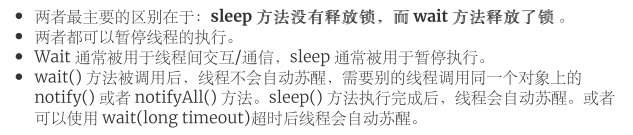

## 死锁

> 死锁,就是两个线程互相获取了对方需要的锁 ,并且等待对面释放自己需要的锁,两个线程互相等待导致死锁的过程!

- 死锁的四个条件

> 1. 互斥条件：**该资源任意适合只可以被一个线程使用。**
> 2. 请求与保持条件：一个进程因**请求资源而阻塞时**，**对已经获得的资源保持不放**！
> 3. 不剥夺条件：线程已获得的条件在未使用完之前不能被其他线程强行剥夺，只有自己使用完毕才释放资源。
> 4. 循环等条件：若干进程之间有一种头尾循环等待资源关系。

- 避免死锁的方法

> 1. 破坏互斥条件：这个条件我们无法解决，锁本身就是互斥的
> 2. 破坏请求保持：一次性获取所有资源，而不是嵌套获取。
> 3. 破坏不剥夺条件：占用资源时，如果获取不到资源，即时释放已经获取到的资源。
> 4. 破坏循环等待条件：靠**按序申请资源来预防**。按**某一顺序申请**资源，释放则**反序释放**资源。

## sleep和wait的共同点和区别



## synchronized关键字

> - 用来保证多个线程之间访问**资源**的**同步性**,**synchronized**关键字保证**被修饰的对象** **方法代码块**，**方法**在任意时刻只能被**一个线程执行**。本质上是一个**可重入锁**。
>
> 1. 修饰实例方法
>
>    **会对当前对象加锁,进入同步方法前需要获取当前对象的锁**
>
> 2. 修饰静态方法
>
>    **执行被关键字修饰的静态方法，需要获取当前类的class对象的锁。**（类对象的锁和当前实例对象的锁是有区分开的，并不是同一个锁）
>
> 3. 修饰代码块
>
>    进入被修饰的代码块，**会对修饰的对象加锁，synchronized（x），是指该代码块需要获取到x对象的锁**
>
> 4. **注意：尽量不要对String对象加锁**
>
>    因为String对象是会缓存在字符串常量池中的，可能会引起其他不确定的线程阻塞（同样的Integer等对象具有缓存功能的也不要上锁）

### 单例模式

```java
package top.cjsx.thread.singleton;
import java.util.concurrent.CountDownLatch;
/**
 * @author: Caden
 * @Date: 2020-06-23 21:21
 * @Desc:
 * 增加volatile是为了防止jvm对指令重排序
 * 1.给对象分配空间
 * 2.初始化该对象
 * 3.将对象引用指向分配的内存
 * <p>
 * 若做了重排序,顺序可能是1-3-2,
 * 线程一执行了1,3 那么线程二获取时,发现该对象!=null,直接返回,可能获取到一个未初始化的对象
 * <p>
 * top.cjsx.thread.singleton.SingletonDemo3@30f3ad2a
 * top.cjsx.thread.singleton.SingletonDemo3@30f3ad2a
 * top.cjsx.thread.singleton.SingletonDemo3@30f3ad2a
 * top.cjsx.thread.singleton.SingletonDemo3@30f3ad2a
 * top.cjsx.thread.singleton.SingletonDemo3@30f3ad2a
 * top.cjsx.thread.singleton.SingletonDemo3@30f3ad2a
 * top.cjsx.thread.singleton.SingletonDemo3@30f3ad2a
 * top.cjsx.thread.singleton.SingletonDemo3@30f3ad2a
 * top.cjsx.thread.singleton.SingletonDemo3@30f3ad2a
 * top.cjsx.thread.singleton.SingletonDemo3@30f3ad2a
 **/
public class SingletonDemo4 {

    private volatile static SingletonDemo4 object;

    public static SingletonDemo4 getObject() {
        if (object == null) {
            synchronized (SingletonDemo4.class) {
                if (object == null) {
                    object = new SingletonDemo4();
                }
            }
        }
        return object;
    }

    public static void main(String[] args) throws InterruptedException {
        for (int i = 0; i < 10; i++) {
            new Thread(() -> {
                SingletonDemo4 object = getObject();
                System.out.println(object);
            }).start();
        }
        CountDownLatch countDownLatch = new CountDownLatch(1);
        countDownLatch.await();
    }
}
```

### 可重入锁

- jdk1.6前 synchronized标识符只是会调用系统底层的互斥锁
- 1.6之后jvm层面对syn做了一系列的优化,并且引入了