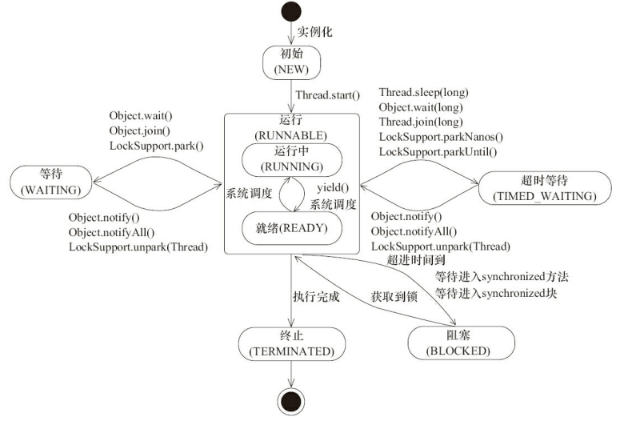

## 线程周期

### NEW

### RUNNABLE

### BLOCKED

### WAITING

### TIME_WAITING

### TERMINATED

|   状态名称   |                             说明                             |
| :----------: | :----------------------------------------------------------: |
|     NEW      |      初始状态，线程被构建，但是没有调用start（）方法。       |
|   RUNNABLE   | 运行状态，Java线程将操作系统中就绪和运行两种状态笼统地称作“运行中”(调用了start一般就会进入该状态) |
|   WAITING    | 等待状态，表示线程进入等待状态，进入该状态表示当前线程需要等待其他线程做出一些特定动作（**通知或中断**）(Thread.sleep()或者object.wait()) |
| TIME_WAITING | 超时等待状态，该状态不同于WAITING，它是可以在指定的时间自行返回的(Object.wait(long millisecond)) |
|  TERMINATED  | 终止状态，当前线程执行完毕(Thread.stop()或者Thread.interrupt(),不建议使用stop,interrupt会将线程设置成准备停止状态) |

